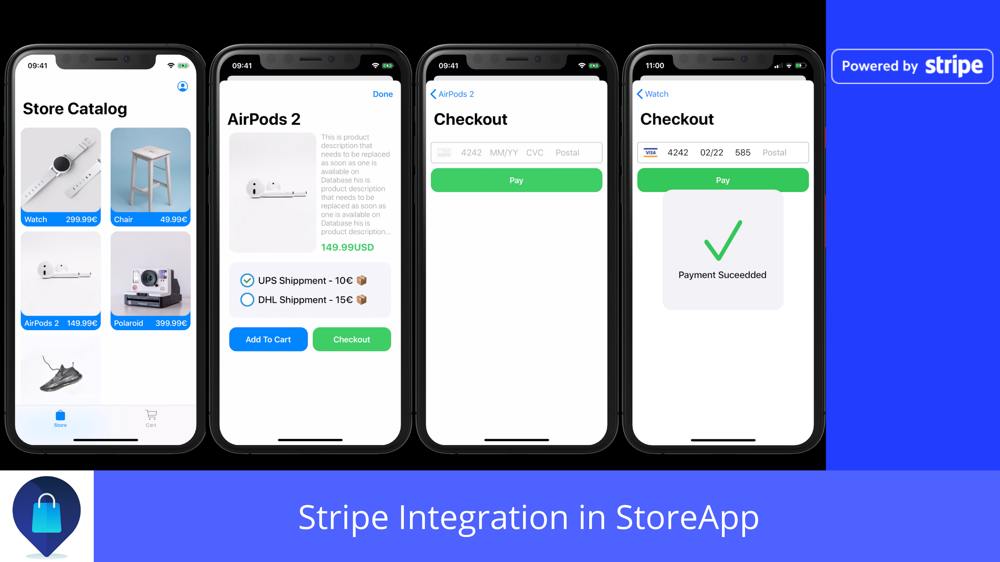

# Integration Of Stripe Payment in Demo StoreApp
> Project consists of Server side written in PHP (with mySQL database) and Client (iOS app) which is listing Products from Server and you can pay for the product through integrated Stripe Payment

### If you like the project, please give it a star ⭐ It will show the creator your appreciation and help others to discover the repo.

## Technologies used

- [x] Native URLSession Networking
- [x] 100% Programmatic UI
- [x] Custom UI Components
- [x] NSCache for caching images
- [x] Stripe SDK (CocoaPod)
- [x] CollectionView with Custom layout
- [x] PHP Server Side
- [x] MVC Architecture

## Requirements

- Open Stripe account and get your API keys
- In Client -> Common -> Model -> LLConstants.swift change API keys and Server URL
- In Server -> stripe.php -> \Stripe\Stripe::setApiKey('YOUR STRIPE SECRET KEY'); -> Replace Secret Key

## Contribute

We would love you for the contribution to **StoreApp-Stripe-Integration**, check the ``LICENSE`` file for more info.

## Meta

Your Name – [@leoleljak](https://twitter.com/leoleljak) – leo.leljak@icloud.com

Distributed under the MIT license. See ``LICENSE`` for more information.

[My other repos](https://github.com/leoleljak?repositories)

[swift-image]:https://img.shields.io/badge/swift-3.0-orange.svg
[swift-url]: https://swift.org/
[license-image]: https://img.shields.io/badge/License-MIT-blue.svg
[license-url]: LICENSE
[travis-image]: https://img.shields.io/travis/dbader/node-datadog-metrics/master.svg?style=flat-square
[travis-url]: https://travis-ci.org/dbader/node-datadog-metrics
[codebeat-image]: https://codebeat.co/badges/c19b47ea-2f9d-45df-8458-b2d952fe9dad
[codebeat-url]: https://codebeat.co/projects/github-com-vsouza-awesomeios-com
